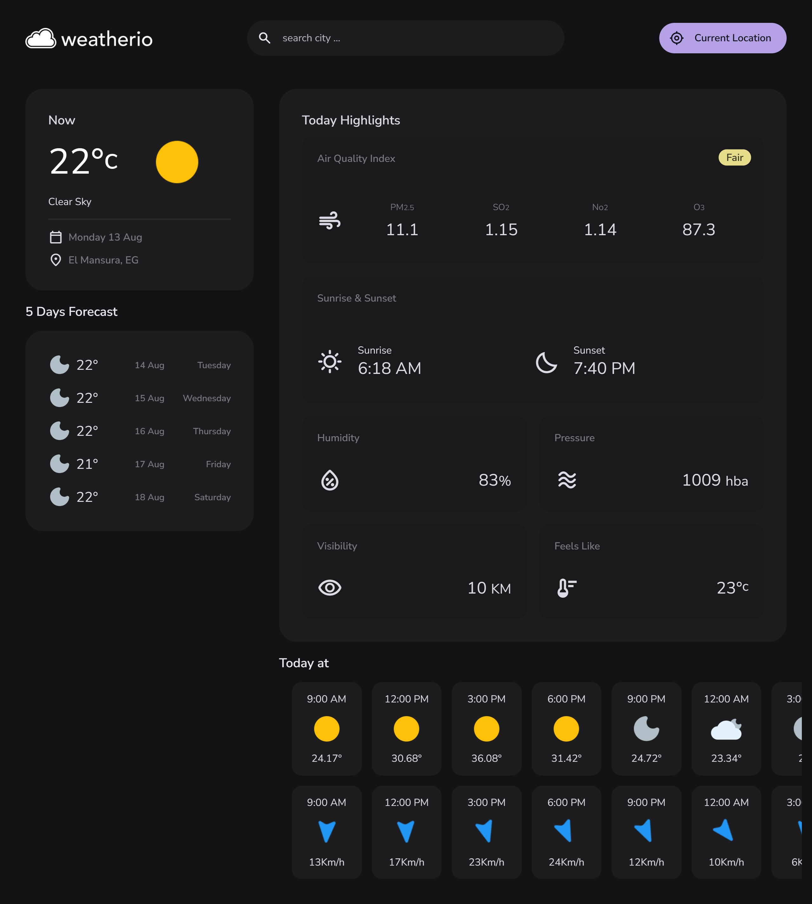
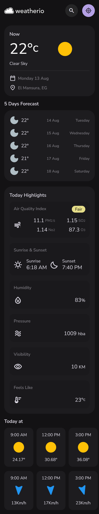

# WeatherInfo

Weatherio is a web application that provides accurate and real-time weather information for cities around the world. With Weatherio, you can explore current weather conditions, 5-day forecasts, wind speed, sunrise and sunset times, air quality, humidity, and more. Stay informed about weather changes effortlessly.

## Features

- **Current Weather**: Get real-time weather updates for your selected city.
- **5-Day Forecast**: View detailed weather forecasts for the next five days.
- **Hourly Forecast**: Check hourly weather updates.
- **Highlights**: Explore additional weather details like wind speed, air quality, and humidity.
- **Search Functionality**: Search for weather information by city name.
- **Current Location**: Quickly access weather details for your current location.
- **Responsive Design**: Optimized for various screen sizes, including desktops, tablets, and mobile devices.

## Project Structure

```
WeatherInfo/
├── favicon.svg
├── index.html
├── README.md
├── assest/
│   ├── route.js
│   ├── css/
│   │   └── style.css
│   ├── font/
│   │   └── material-symbol-rounded.woff2
│   ├── images/
│   │   ├── logo.png
│   │   ├── openweather.png
│   │   └── weather_icons/
│   │       ├── 01d.png
│   │       ├── 01n.png
│   │       └── ...
│   ├── js/
│       ├── api.js
│       ├── app.js
│       ├── module.js
│       └── route.js
├── screenshots/
│   ├── 1024x768.png
│   ├── 1080x768.png
│   └── ...
```

## Technologies Used

- **HTML5**: For structuring the web pages.
- **CSS3**: For styling and layout.
- **JavaScript (ES6)**: For dynamic content and interactivity.
- **Google Fonts**: For typography.
- **OpenWeather API**: For fetching weather data.

## How to Use

1. Clone the repository:
   ```bash
   git clone <repository-url>
   ```
2. Open the `index.html` file in your browser to view the application.

## Screenshots

### Desktop View


### Mobile View


## Credits

- Weather data provided by [OpenWeather](https://openweathermap.org/).
- Icons and fonts from Google Fonts and Material Symbols.

## License

This project is licensed under the Pranshant Mishra.